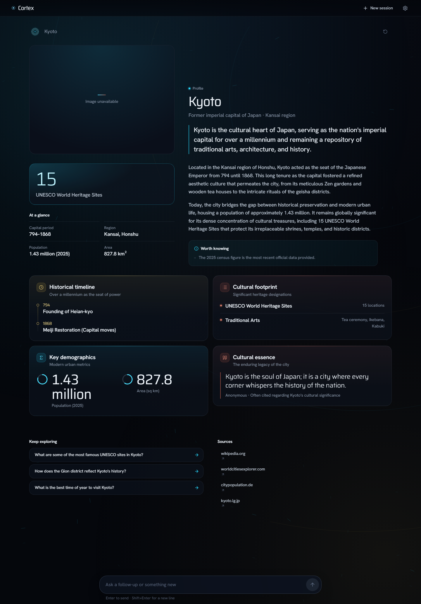
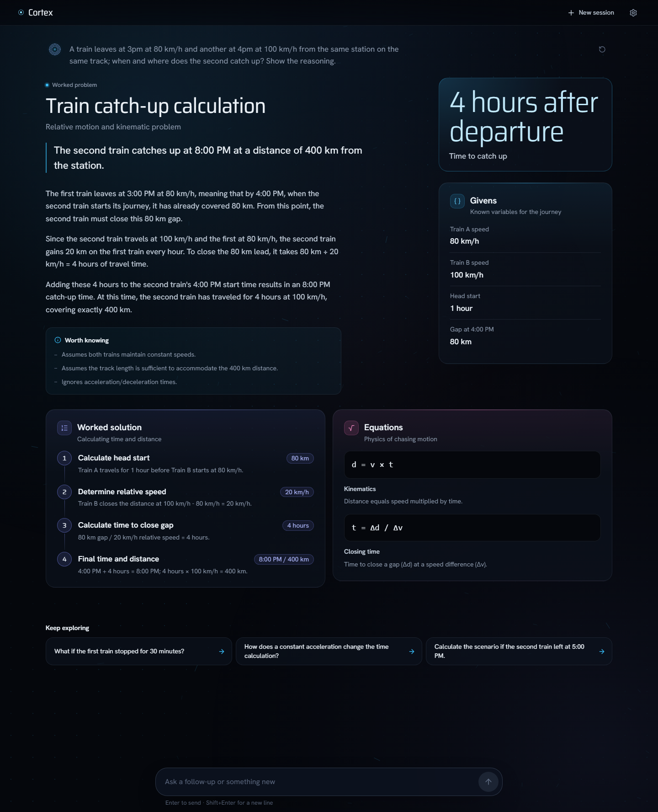
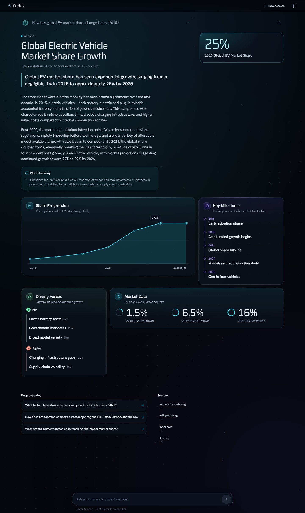
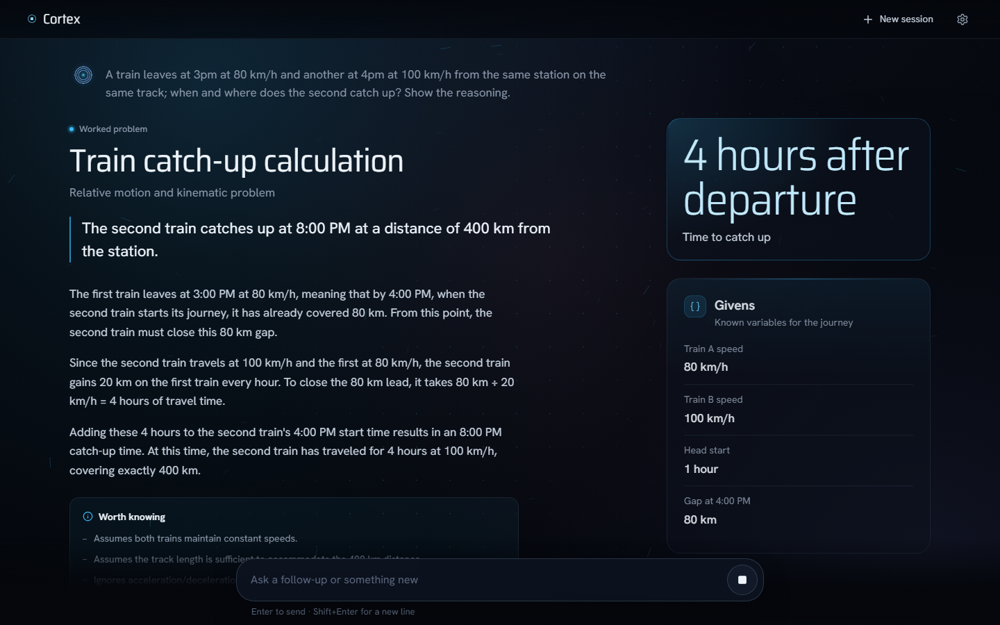
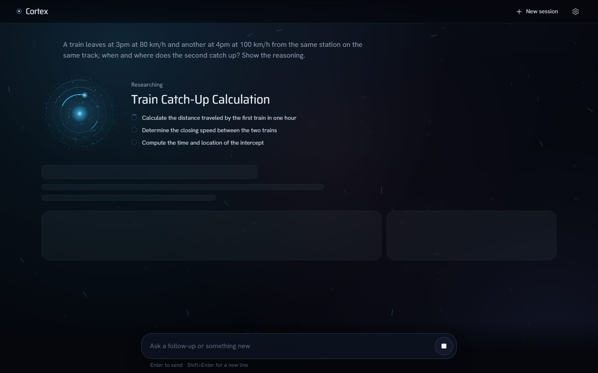
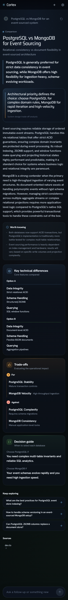

# CORTEX

An answer engine that builds its own interface. Ask anything — a person, a place, a worked physics
problem, a procedure, a comparison, today's news — and a Gemini model returns a *Scene*: the complete
answer plus a presentation spec (intent, layout, mood, motif, density, palette, module kinds) that a
fixed set of React components renders. The answer streams in: a fast router themes the interface in
about a second, a grounded research pass brings back real sources, and the scene materialises piece by
piece instead of appearing after a spinner.



---

## What it does

- **Answers first.** Every scene starts with `answer.headline` (the direct answer in one sentence) and
  `answer.body` (up to 8 paragraphs that stand on their own), then modules that support it.
- **Chooses its own composition.** The model classifies the question and the interface follows:

  | Intent | Layout | Reads as |
  |---|---|---|
  | `entity` | `dossier` | identity, hero media, attribute rail |
  | `explanation`, `problem`, `analysis` | `focus` | answer-first reading column with a readout rail |
  | `howto`, `current` | `sequence` | ordered procedure or chronology |
  | `comparison` | `split` | two sides, A/B tabs on mobile |
  | data-heavy subjects | `mosaic` | dense tile grid |

- **Module kinds** drive the renderers: `list`, `timeline`, `stats`, `comparison`, `quote`, `ranking`,
  `progress`, `keyvalue`, `tags`, `steps`, `formula`, `code`, `prose`, `proscons`, `chart`.
- **Presentation** carries `mood` (calm / kinetic / archival / volatile), `motif` (the ambient field:
  flow / rings / grid / none), `density` and a three-colour `palette` that tints the whole turn.
- **Multi-turn session.** Each question becomes a turn in an infinite vertical stream; older turns keep
  their own palette, follow-up chips append new turns, and only the newest turn is ever in flight.
- **Responsive by design**, not by squeezing: one composition per layout at 360–430, 768–1024 and
  ≥1280 px, 44 px touch targets, no horizontal scroll, `dvh` + safe-area aware command bar.
- **Reduced motion** (OS preference or the in-app setting) stills the canvases and the entrance stagger.
- **EN / ES** for the whole UI and for the model's answers.

---

## How an answer arrives

`POST /api/cortex/stream` is a server-sent event stream:

| Event | When | Payload |
|---|---|---|
| `preface` | ~1.2 s | `intent`, `title`, `layout`, `mood`, `palette`, 3 research steps — themes the UI and fills the plan |
| `research` | ~2.5 s | how many searches ran and how many sources came back |
| `partial` | from ~4 s | a scene with only the fields the model has finished writing |
| `scene` | 7–13 s | the authoritative, validated scene |
| `error` / `done` | end | error code, or the timing summary |

Three model calls, in two stages:

1. **Preface** (`gemini-3.5-flash-lite`, thinking `MINIMAL`, no tools) and **research**
   (`gemini-3.5-flash-lite` + `google_search`, plain text, no schema) start together at t=0.
2. **The main call** (`gemini-3.8-flash`, structured output, thinking `LOW`, `MEDIUM` for `problem`)
   starts with the research notes in its prompt and streams the scene.

Grounding lives in the research stage on purpose: with the full Scene prompt **or** the Scene schema
attached, `gemini-3.8-flash` never invokes `google_search` (measured across schema / no-schema /
`MEDIUM` thinking / explicit instructions — zero searches every time), while the short research prompt
searches on every question that needs it and correctly skips pure arithmetic. Sources come from
`groundingMetadata.groundingChunks`, https-only, deduped, capped at 8.

Partials are throttled to ~130 ms and only carry settled values: the last key of an object and the last
element of an array can still be mid-write, so they are held back, and a module appears only once it is
complete. Paragraphs grow phrase by phrase; text already on screen never re-animates.

Client disconnects abort the upstream call. `POST /api/cortex` (non-streamed, final scene only) still works.

---

## Screenshots

Every scene below is real model output captured through the fixture replay (`npm run shots`).

<table>
<tr>
<td width="50%"></td>
<td width="50%"></td>
</tr>
<tr>
<td><b>Worked problem</b> — <code>focus</code> · <code>calm</code>: key figure and givens in the rail, the worked solution and the equations under the answer.</td>
<td><b>Analysis</b> — <code>mosaic</code> · <code>kinetic</code>: a <code>chart</code> series, milestones, drivers and grounded sources.</td>
</tr>
<tr>
<td></td>
<td></td>
</tr>
<tr>
<td><b>Mid-stream</b> — partial scenes: the headline and the first paragraphs are live while the modules are still being written.</td>
<td><b>Thinking</b> — the core takes the preface palette and the three plan steps light up on real events.</td>
</tr>
<tr>
<td align="center"></td>
<td valign="top"><b>Mobile</b> — the same compositions at 390 px: single column in reading order, the two sides of a <code>split</code> as A/B tabs, everything above 44 px. <code>landing-390.png</code>, <code>streaming-390.png</code> and one capture per fixture live in <code>docs/screenshots/</code> at 390, 768 and 1440.</td>
</tr>
</table>

---

## Stack

| Layer | Choice |
|---|---|
| Frontend | React 19.3 + Vite 8.3 + TypeScript 6 (strict) |
| Styling | CSS Modules + design tokens (`tokens.css`) — no CSS framework |
| Canvas | One rAF ticker driving the thinking core and the ambient field (2D canvas, transform + opacity only) |
| i18n | Typed in-house module (`src/i18n/translations.ts`), EN + ES |
| Backend | Node.js + Express 5, SSE over POST |
| AI runtime | Genkit 1.42 + `@genkit-ai/google-genai` (zod 3 via `import { z } from 'genkit'`) |
| Models | `gemini-3.8-flash` (answer), `gemini-3.5-flash-lite` (preface and research) |
| Fonts | Hanken Grotesk (body), Saira (display), JetBrains Mono (code) |
| Icons | lucide-react |

---

## Setup

```bash
npm install
```

Create `.env`:

```env
GEMINI_API_KEY=AIza...
PORT=3001
```

Get a key at [aistudio.google.com](https://aistudio.google.com). The variable must be named
`GEMINI_API_KEY`; a `VITE_`-prefixed key is never read by the server and never reaches the browser.

```bash
npm run dev
```

The backend (port 3001) and the frontend open in **two terminal windows** — `tsx watch` needs its own
TTY, and running both through `concurrently` in one pane is unreliable on Windows. Then open
[http://localhost:5173](http://localhost:5173). `npm run dev:concurrent` uses a single pane;
`npm run dev:server` and `npm run dev:client` run each side separately.

`GET /api/health` reports the resolved models and whether fixtures are on.

### Environment variables

| Variable | Default | Purpose |
|---|---|---|
| `GEMINI_API_KEY` | — | Required unless `CORTEX_FIXTURES=1` |
| `GEMINI_MODEL` | `gemini-3.8-flash` | The answer model (needs structured output) |
| `GEMINI_PREFACE_MODEL` | `gemini-3.5-flash-lite` | Fast router for the preface |
| `GEMINI_RESEARCH_MODEL` | `gemini-3.5-flash-lite` | Grounded research stage (needs `google_search`) |
| `GEMINI_TIMEOUT_MS` | `75000` | Upstream cap for the main call |
| `CORTEX_PREFACE_TIMEOUT_MS` | `8000` | The preface never blocks the answer |
| `CORTEX_RESEARCH_TIMEOUT_MS` | `15000` | On timeout the answer is written ungrounded (no sources) |
| `CORTEX_FIXTURES` | off | `1` replays saved scenes through the same SSE path, no paid calls. Needs `NODE_ENV=development` |
| `CORTEX_FIXTURES_DIR` | `server/fixtures` | Where the replay reads from |
| `CORTEX_CAPTURE_DIR` | off | Writes every real answer (preface + scene + timings) as a fixture. Needs `NODE_ENV=development` |
| `PORT` | `3001` | API port |

---

## Development

```bash
npm run typecheck                  # client + server
npm run build                      # tsc (server) + vite build (client)
npx tsx scripts/drift-check.mts    # server/domain/Scene.ts vs src/domain/Scene.ts must not drift
npm run shots                      # screenshots + overflow audit at 390, 768 and 1440
```

`npm run shots` starts the API with `CORTEX_FIXTURES=1` and the Vite client, then captures the landing
screen, the thinking state, a mid-stream state and every fixture at the three sizes into
`docs/screenshots/`. Each capture asserts there is no horizontal page scroll and lists any element
whose content overflows its box. Options: `--sizes=390,1440`, `--only=kyoto`, `--out=…`,
`--fixtures-dir=…`, `--no-servers`.

To refresh the fixtures with real output:

```bash
NODE_ENV=development CORTEX_CAPTURE_DIR=server/fixtures npm run dev:server
```

Both fixture modes fail closed and log why when refused: they run only when `NODE_ENV` is
`development`. `npm run shots` sets that itself; every other entry point, including `npm run dev`,
needs it spelled out on the command line.

Every query you then run is saved as `server/fixtures/<slug>.json`.

---

## The Scene contract

One JSON object, validated twice — `server/domain/Scene.ts` and its byte-for-byte mirror
`src/domain/Scene.ts` (the drift check enforces it):

```
version · intent · type · title · subtitle
presentation { layout, mood, motif, density, palette { primary, secondary, accent } }
answer { headline, body[], caveats[] }
spotlight { kind: stat | quote | callout, label, value?, source? }
summary · image_url · image_query · meta{}
modules[]  (0–8)
├── category · color · kind · headline? · facts[] · body? · value?
│   └── items[] { label, value?, detail?, weight?, side? }   (shape depends on kind)
followups[]  ·  sources[] { title, url }   (from grounding, server-side)
```

`presentation` is written before `answer` on purpose: the interface can theme itself from the first
chunk of the stream.

### Safety

The model never emits HTML, CSS or JavaScript — it only picks among fixed components.

- The **wire schema** (OpenAPI 3.0 subset) is handed to Gemini as `output.schema`; its descriptions are
  the field-level guidance.
- The **strict schema** validates and normalises the reply: enums fall back, text is bounded and cut at
  a word boundary, lists are capped, weights clamp to 0–100. Only a missing `title` or a non-array
  `modules` fails the parse; everything else degrades.
- Colours must be 6 hex digits (a bare `RRGGBB` is accepted and prefixed) and are lifted into a
  luminous band so they stay readable on near-black; URLs must be `https:`; control characters are
  stripped and angle brackets neutralised.
- `sanitizeCode` (code bodies and formula labels only) keeps `<`, `>` and indentation and is rendered
  exclusively as React text inside `<pre>`. Inline `**bold**` and `` `code` `` are parsed into React
  nodes — there is no `dangerouslySetInnerHTML` anywhere.
- The client re-runs `sanitizeScene` on every partial and on the final scene, so the UI never trusts
  the wire.
- Bodies are limited to 16 KB and queries to 2000 characters. Error codes: `400 INVALID_INPUT`,
  `422 PARSE_FAILURE` / `VALIDATION_ERROR`, `502 GEMINI_ERROR`, `499` on client abort.

---

## Project structure

```
cortex/
├── server/
│   ├── index.ts                     # Express entry point
│   ├── application/
│   │   ├── cortexStream.ts          # SSE orchestration + fixture replay with simulated partials
│   │   ├── research.ts              # Grounded search stage (brief + sources + entity image)
│   │   ├── preface.ts               # Fast router call
│   │   ├── cortexFlow.ts            # Main streamed call, profile fallback, source merge
│   │   ├── partial.ts               # Settled-value extraction from half-parsed stream output
│   │   └── prompt.ts                # System prompt, routing rules, research prompt, main turn
│   ├── domain/Scene.ts              # Wire schema + strict schema (zod 3 via genkit)
│   ├── infrastructure/              # Genkit client, grounding, JSON recovery, fixtures
│   └── presentation/cortexRouter.ts # POST /api/cortex, POST /api/cortex/stream, GET /api/health
├── src/
│   ├── application/                 # SSE client + multi-turn session hook
│   ├── domain/Scene.ts              # Mirror of the contract + client sanitizers
│   ├── i18n/                        # All UI strings (EN + ES)
│   └── presentation/
│       ├── canvas/                  # ThinkingCore, AmbientField, shared rAF ticker
│       ├── components/              # command bar, session stream, compositions, module kinds
│       ├── scene/                   # SceneTheme (per-turn CSS vars), tokens
│       └── styles/                  # tokens.css + global.css
├── scripts/shots.mts                # Screenshot + overflow pass
├── scripts/drift-check.mts          # Contract mirror check
└── server/fixtures/                 # Captured real scenes for offline iteration
```

---

## Notes

- The API key is server-side only.
- Settings (language, motion) persist in `localStorage` under `cortex.settings`.
- The client gives up after 20 s without a first event or 45 s of silence; the server sends a heartbeat
  every 15 s.
- A scene that comes back with nothing to show renders an empty state with retry, never a blank stage.
