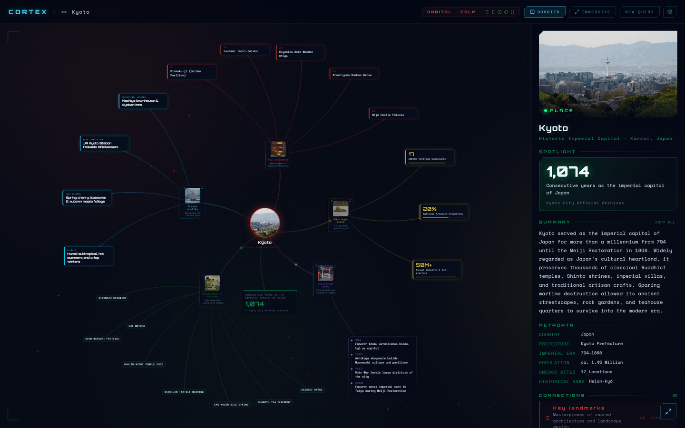
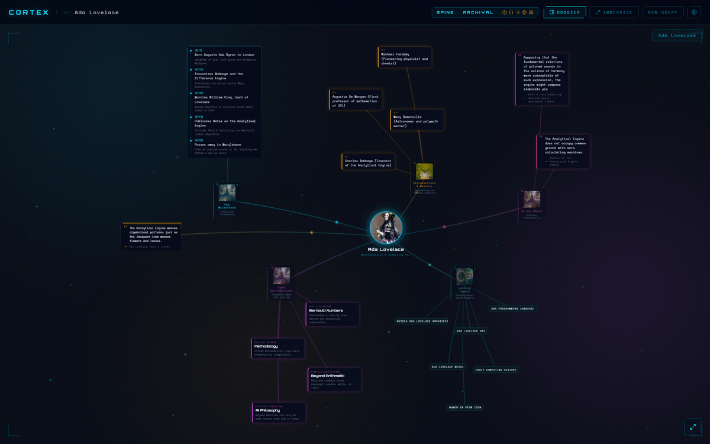
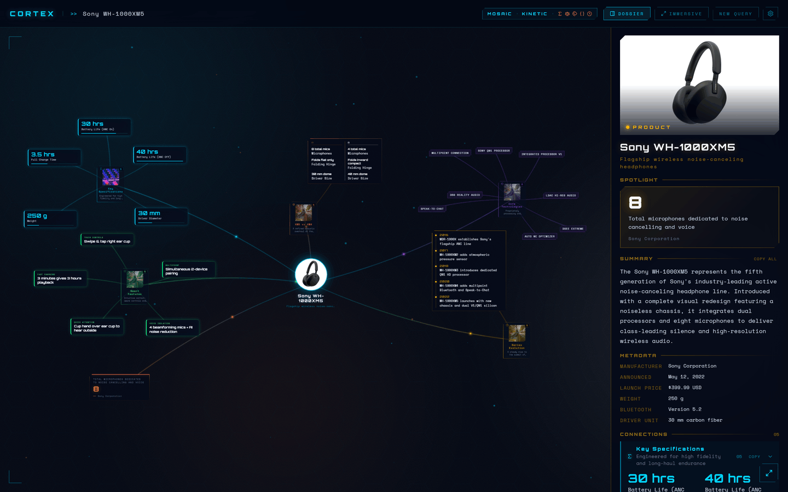
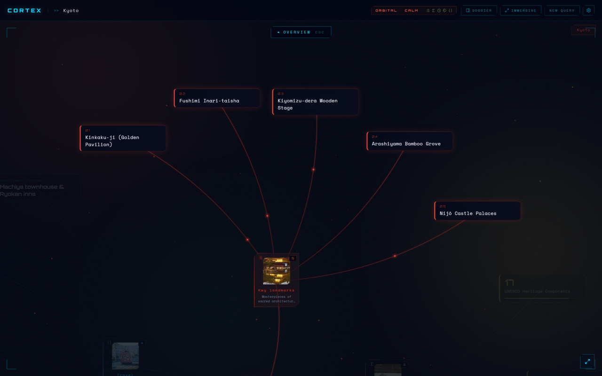
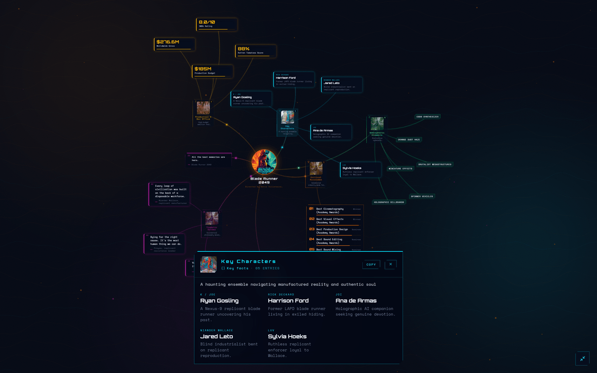
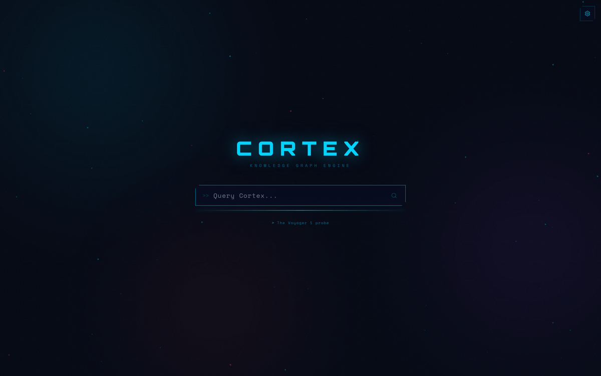
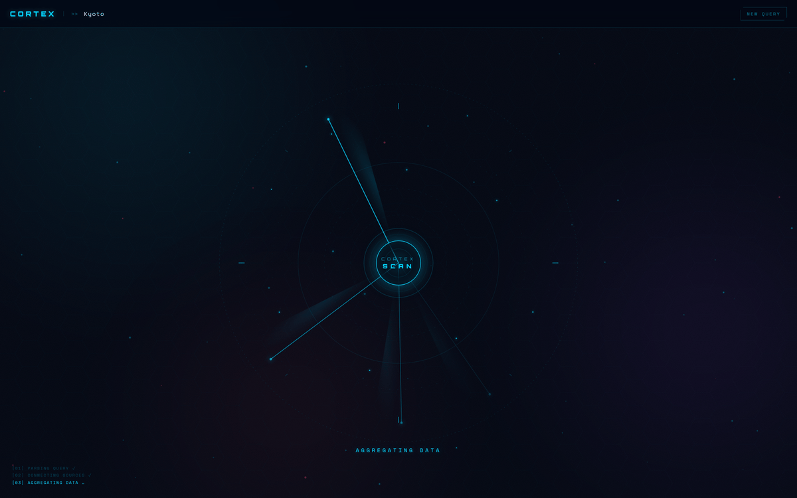
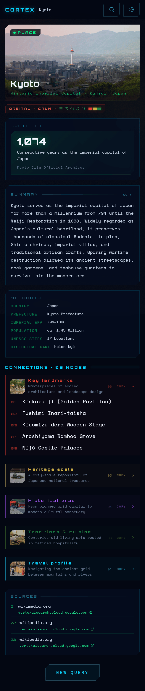

# CORTEX

A generative knowledge graph visualizer. Type any query — a person, place, film, company, concept — and a Gemini model returns a *Scene*: the facts about the subject plus a presentation spec (layout archetype, mood, motif, palette, fact kinds) that a fixed set of components renders as an animated, interactive node graph.



---

## What it does

- Submits your query to a Gemini model with structured output and Google Search grounding
- Validates the reply into a Scene and renders it as a graph: subject at the center, categories around it, every fact visible with zero overlap
- The model chooses the presentation from the nature of the subject:
  - **Archetype** (spatial layout): `constellation`, `orbital`, `spine`, `mosaic`, `spiral`
  - **Mood** (motion and tone): `calm`, `kinetic`, `archival`, `volatile`
  - **Motif** (background pattern): `hex`, `lattice`, `wave`, `rings`, `none`
  - **Density**: `sparse`, `balanced`, `dense`
  - **Palette**: three hex colors the whole UI is tinted with
- Each category has a **kind** that drives its renderer: `list`, `timeline`, `stats`, `comparison`, `quote`, `ranking`, `progress`, `keyvalue`, `tags`
- A **spotlight** node (stat, quote or callout) hangs off the center; grounding **sources** are listed in the dossier
- Pan, zoom (wheel / trackpad pinch / touch pinch) and auto fit-to-view for any graph size
- Dossier panel: a research sidebar with the hero image, spotlight, summary, metadata, every category and the sources — selectable and copyable
- Immersive mode (`i` key or toggle): hides all chrome; category details open in a glass bottom sheet
- Click any image to open it in a lightbox; failed images fall back to an animated monogram
- Settings: default view mode (panel / immersive), language (EN / ES, also the language Gemini answers in) and motion (auto / reduced)
- Mobile (<768px): an ordered layout — hero card, scene signature, spotlight, summary, metadata, category accordions, sources

---

## Screenshots

Every scene below is a real model response. The same query can come back with a different archetype, palette and mix of kinds, so no two runs look alike.

<table>
<tr>
<td width="50%"></td>
<td width="50%"></td>
</tr>
<tr>
<td><b>Ada Lovelace</b> — <code>spine</code> · <code>archival</code> · <code>hex</code>, dossier closed: a <code>timeline</code> block, two <code>quote</code> cards and a <code>tags</code> cluster.</td>
<td><b>Sony WH-1000XM5</b> — <code>mosaic</code> · <code>kinetic</code>, dossier open: <code>stats</code> chips, a <code>comparison</code> block against the XM4 and a <code>timeline</code>.</td>
</tr>
<tr>
<td></td>
<td></td>
</tr>
<tr>
<td><b>Focus mode</b> — Kyoto, <code>orbital</code> · <code>calm</code>: clicking the <code>list</code> category zooms the camera to that subtree and dims everything else.</td>
<td><b>Immersive mode</b> — Blade Runner 2049, <code>spiral</code> · <code>kinetic</code>: chrome hidden, a <code>keyvalue</code> category open in the glass sheet.</td>
</tr>
<tr>
<td></td>
<td></td>
</tr>
<tr>
<td><b>Query screen</b> — the example query under the input cycles while you type.</td>
<td><b>Loading</b> — the radar scan runs through parse / connect / aggregate while the model answers.</td>
</tr>
<tr>
<td align="center"></td>
<td valign="top"><b>Mobile</b> — the same Kyoto <code>orbital</code> · <code>calm</code> scene under 768px: the graph is replaced by an ordered document — hero card, scene signature, <code>stat</code> spotlight, summary, metadata, one accordion per category (the first open) and the grounding sources.</td>
</tr>
</table>

---

## Stack

| Layer | Choice |
|---|---|
| Frontend | React 19.3 + Vite 8.3 + TypeScript 6 (strict) |
| Layout engine | `d3-force` (settled synchronously) + custom rectangle collision, one recipe per archetype |
| Styling | CSS Modules + design tokens (`tokens.css`) — no CSS framework |
| i18n | Typed in-house module (`src/i18n/translations.ts`), EN default + ES |
| Backend | Node.js + Express 5 |
| AI runtime | Genkit 1.42 + `@genkit-ai/google-genai` |
| AI model | Gemini 3.8 Flash by default (configurable via `GEMINI_MODEL`) |
| Model output | Structured output (`output.schema`, zod) + `googleSearch` grounding |
| Rendering | SVG edges + absolute-positioned HTML nodes on a pan/zoom stage |
| Fonts | Orbitron + Space Mono (Google Fonts) |
| Icons | lucide-react |

---

## Setup

**1. Install dependencies**

```bash
npm install
```

**2. Create `.env`**

```env
GEMINI_API_KEY=AIza...
GEMINI_MODEL=gemini-3.8-flash
PORT=3001
GEMINI_TIMEOUT_MS=75000
```

Get an API key at [aistudio.google.com](https://aistudio.google.com). The variable must be named `GEMINI_API_KEY` — a `VITE_`-prefixed key is never read by the server.

**3. Run**

```bash
npm run dev
```

This opens the backend (API on port 3001) and the frontend in **two separate
terminal windows**. Wait for `Cortex server running on http://localhost:3001 (model: …)`
in the SERVER window, then open [http://localhost:5173](http://localhost:5173).

> Why two windows? `tsx watch` needs its own console (TTY). Running both
> processes through `concurrently` in one pane is unreliable on Windows — the
> server's watch child fails to keep the port bound and the client gets
> `ECONNREFUSED`. Separate windows sidestep that.

Prefer a single pane? `npm run dev:concurrent` still uses `concurrently`, or run
each side yourself: `npm run dev:server` and `npm run dev:client`.

`GET /api/health` returns `{ ok, model }` so you can confirm which model the server resolved.

---

## Switching models

Change `GEMINI_MODEL` in `.env` and restart the dev server. Any Gemini model that supports structured output and the `google_search` grounding tool works:

| Model | Notes |
|---|---|
| `gemini-3.8-flash` | Default — fast, good quality |
| `gemini-3.5-flash-lite` | Cheaper, slightly lighter |
| `gemini-3.1-pro-preview` | Best quality, slower, preview |

`gemini-2.0-flash` (the previous default) was shut down on 2026-06-01; older `.env` files pointing at it must be updated.

---

## The Scene contract

The model returns one JSON object. Field names are fixed; the values drive both the content and the presentation:

```
type · title · subtitle · summary · image_url · image_query · meta[{key, value}]
presentation { archetype, mood, motif, density, palette { primary, secondary, accent } }
spotlight { kind: stat | quote | callout, label, value?, source? }
graph[]
├── category · color · image_query · kind · headline? · facts[]
│   └── items[] { label, value?, detail?, weight?, side? }   (shape depends on kind)
└── ...
sources[] { title, url }   (from grounding metadata, server-side)
```

The model returns 4–8 categories depending on how information-rich the subject is, and must mix kinds. `facts` is always filled as the plain-text fallback; `items` carries the structured form each kind renders (dates for `timeline`, weights for `stats` / `ranking` / `progress`, sides for `comparison`).

The request body is `{ query: string, lang?: 'en' | 'es' }`. Human-readable values come back in the requested language; JSON field names, enum values and `image_query` always stay in English.

### Safety

The model never emits HTML, CSS or JavaScript — it only chooses among a fixed set of components. Two schemas enforce that (`server/domain/Scene.ts`, mirrored in `src/domain/Scene.ts`):

- **Wire schema** (OpenAPI subset) is handed to Gemini as `output.schema`; its descriptions are the model's field-level guidance.
- **Strict schema** validates and normalises the untrusted reply: enums fall back to defaults, text is bounded (title 120, subtitle 160, summary 900, fact / label 160, value 80, detail 240, headline 140, category name 40), lists are capped (8 categories, 6 items or 12 tags, 8 meta, 8 sources), weights are clamped to 0–100. Only a missing `title` or a non-array `graph` fails the parse.
- URLs must be `https:` (anything else becomes `''` and the image cascade takes over); colors must be 6-digit hex; control characters are stripped and angle brackets neutralised.
- The client runs `sanitizeScene` on every response again, so the UI never trusts the wire directly.
- The API limits JSON bodies to 16 KB and queries to 200 characters. Error codes: `400 INVALID_INPUT`, `422 PARSE_FAILURE` / `VALIDATION_ERROR`, `502 GEMINI_ERROR`, `500` otherwise.

Server flow (`server/application/cortexFlow.ts`): structured output with low thinking and `googleSearch` grounding; when the API rejects that request shape with a 400, the request is retried as plain-text JSON extraction (`parseScene.ts`) and that shape is kept for the rest of the process. Sources are read from `groundingMetadata.groundingChunks`, https-only, deduped by host + path and capped at 8 (`grounding.ts`).

### The no-overlap guarantee

Nodes have variable heights (text is never truncated) and heterogeneous roles — category cards, one card per item, one composite block per `timeline` / `comparison` / `ranking` / `progress` category, plus the spotlight — so the layout is solved, not positioned:

1. Every node's real React content is rendered offscreen at its role width and measured from the DOM once `document.fonts.ready` resolves (`useMeasuredSizes`); the probe and the stage share one renderer, so measured and rendered boxes cannot drift
2. The archetype recipe seeds positions and force targets (`src/layout/archetypes.ts`); a `d3-force` simulation (link + charge + radial + positional + circle collision + a custom rectangle pass) is settled synchronously with a fixed tick count, then a final rectangle-separation pass guarantees zero intersections — deterministic per dataset
3. The ambient float drift is capped below half the collision padding, so nodes never touch while drifting
4. The union bounding box is fitted to the viewport (`fitView`), and refitted on resize, dossier toggle, immersive toggle and focus

`npx tsx scripts/layout-check.mts` asserts zero rectangle intersections on 45 synthetic cases (5 archetypes × 3 densities × 3 dataset sizes, with composite blocks and a spotlight).

---

## Interactions

| Action | Effect |
|---|---|
| Type query + Enter | Submits search (200 characters max, counter from 140), plays the choreographed reveal |
| Drag / wheel / pinch | Pan and zoom the graph |
| Double-click background | Re-fit the whole graph |
| Click category node | Focus mode — camera zooms to that subtree, the rest dims (Esc to exit) |
| Click category node (immersive) | Opens the category detail sheet |
| Click spotlight node | Opens the dossier and scrolls to the spotlight block |
| Click center image / hero image | Opens the lightbox |
| `i` | Toggle immersive mode |
| Signature chip (top bar) | Shows archetype · mood · kind glyphs of the current scene |
| Click query chip | Re-runs a previous query |
| Gear icon | Settings: default view mode, language, motion |
| NEW QUERY | Returns to the input screen (rotating example queries) |

---

## Project structure

```
cortex/
├── server/                    # Node.js/Express backend
│   ├── index.ts               # Entry point — loads dotenv, starts Express
│   ├── application/
│   │   ├── cortexFlow.ts      # Genkit flow — structured output, grounding, fallback
│   │   └── prompt.ts          # System prompt: Scene shape + presentation rules
│   ├── domain/
│   │   ├── Scene.ts           # Wire schema + strict schema (zod)
│   │   ├── GraphData.ts       # Entity types
│   │   └── errors.ts          # CortexError codes
│   ├── infrastructure/
│   │   ├── geminiClient.ts    # Genkit + googleAI plugin setup, model resolution
│   │   ├── parseScene.ts      # JSON extraction from free text
│   │   └── grounding.ts       # Sources from grounding metadata
│   └── presentation/
│       └── cortexRouter.ts    # POST /api/cortex, GET /api/health
├── src/                       # React frontend
│   ├── main.tsx               # React root mount + global CSS imports
│   ├── Cortex.tsx             # Root: providers, SceneTheme, desktop/mobile branch
│   ├── application/           # useCortex hook + API client (sanitizeScene)
│   ├── domain/                # Scene contract mirror + type colors
│   ├── i18n/                  # translations.ts (all UI strings) + context
│   ├── infrastructure/        # Color constants + image URL presets
│   ├── layout/                # forceLayout, archetypes, sceneNodes, sceneMetrics, fitView
│   └── presentation/
│       ├── styles/            # tokens.css + global.css
│       ├── scene/             # SceneTheme, sceneTokens, choreography, sceneSignature
│       ├── hooks/             # panZoom, settings, ui state, breakpoint, reduced motion
│       └── components/
│           ├── HexGrid.tsx    # Background motif layer (hex, lattice, wave, rings)
│           ├── graph/         # GraphStage, EdgeLayer, nodes, useMeasuredSizes
│           ├── facts/         # Kind renderers (list, timeline, stats, ...)
│           ├── dossier/       # Research panel, spotlight, sources, dossierLayout
│           ├── overlay/       # Lightbox, NodeDetailSheet
│           ├── settings/      # SettingsMenu
│           ├── shared/        # SceneSignature, EmptyState, Monogram
│           ├── mobile/        # MobileExplorer, HeroCard
│           └── background/    # Nebula, Particles
├── scripts/layout-check.mts   # No-overlap assertion on synthetic datasets
├── index.html
├── vite.config.ts
└── .env                       # Your API key (gitignored)
```

---

## Notes

- The Gemini API key lives server-side only — it is never exposed to the browser.
- `GEMINI_TIMEOUT_MS` (optional, default `75000`) caps how long the server waits for the model before answering `502 GEMINI_ERROR`; the browser gives up after 90 s.
- Images cascade: direct URL from the model → keyword fallback (loremflickr) → animated monogram. Nothing ever renders broken.
- All user-visible UI strings live in `src/i18n/translations.ts` — components never hardcode visible text.
- Settings persist in `localStorage` under `cortex.settings`.
- Reduced motion (the OS preference or the in-app MOTION setting, stamped as `data-motion="reduced"` on `<html>`) disables the float loop, particles, entrance stagger and long transitions.
- A scene with no categories renders an empty state with retry instead of a blank stage.
